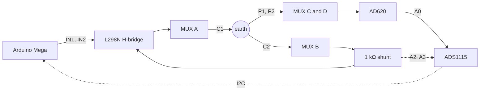

# diy-ert

<!-- photo of the breadboard build / field setup goes here -->

A four electrode earth resistivity meter (Wenner array) built from scratch
in about a month, for roughly $150 in parts. Commercial instruments that
make the same measurement start above $20,000.

This repo is written as an engineering log. Four ADS1115 ADCs died during
development, all from the same root cause, and the
[failure log](docs/failure-log.md) is probably the most useful file here.
Read it before powering anything up.

## Results

| Test | Result |
|---|---|
| Bench, known 100 Ω resistor | measured 98.6 Ω (1.4% error) |
| Field, moist Georgia clay, a = 0.5 m | 71-72 Ω·m apparent resistivity, 1.24 mA injected |

No 2D image yet. What exists today is a validated single point measurement
and one good field reading. Full status below.

## How it works

Contact resistance is the whole problem. Where a steel rod meets soil this
build measured 40-80 kΩ, and a two electrode measurement puts that
directly in series with the tens of ohms of ground you actually want. So
the roles are split across four electrodes: current goes in through the
outer pair (C1, C2), and the voltage it creates in the ground is read
across a separate inner pair (P1, P2). The potential pair feeds an
instrumentation amplifier and draws essentially no current, so its contact
resistance drops no voltage and falls out of the result. On the current
side, contact resistance only limits how much current flows, and the
current is measured across a shunt rather than assumed.

From there it is Ohm's law: R = V/I, and apparent resistivity
ρ = 2πa·R for electrode spacing a. Details in [docs/theory.md](docs/theory.md).



The H-bridge flips the injection polarity every ~150 ms. Differencing the
two half cycles cancels electrode self-potential and amplifier offset, and
stacking 20 cycles averages the noise down. The AD620 stage gain is 76,
measured with a multimeter during calibration rather than taken from the
trimmer setting. Four 16-channel muxes let any of 16 electrodes play any
of the four roles.

## Status

- [x] Bench validation against a known resistor
- [x] One field reading
- [x] 16 channel electrode switching built, 12 of 16 channels working
      (breadboard contact faults, see the failure log)
- [x] Automated Wenner survey firmware, outputs pyGIMLi format
- [ ] Non-polarising potential electrodes (steel rods drift within minutes)
- [ ] PCB: schematic done and checked, layout in progress
- [ ] 2D survey of real ground

## Documentation

In reading order:

1. [Theory](docs/theory.md): Ohm's law through the ground, Wenner
   geometry, why the polarity alternates, why stacking works
2. [Hardware](docs/hardware.md): the signal chain, wiring reference, and
   five design constraints learned the hard way
3. [Calibration](docs/calibration.md): the offset/gain procedure in the
   order that converges, with the numbers from this build
4. [Failure log](docs/failure-log.md): symptom, root cause, and fix for
   every failure, including the four dead ADCs
5. [Field procedure](docs/field-procedure.md): how the field reading was
   taken and what limits survey duration
6. [Firmware](firmware/README.md): seven sketches that bring the
   instrument up one verified subsystem at a time. Run them in order.

## Repository layout

```
diy-ert/
├── docs/          theory, hardware, calibration, failure log, field procedure
├── firmware/      seven bring-up sketches, 00 through 06, run in order
├── hardware/      PCB status, bill of materials, KiCad files
├── analysis/      pyGIMLi inversion script and data format notes
└── data/          data format spec and the one validated field reading
```

## Cost

Roughly $150 in parts including spares. The bill of materials, with notes
on which parts to buy in DIP packages so they can be socketed and swapped,
is in [hardware/README.md](hardware/README.md).

## License

MIT, see [LICENSE](LICENSE).
