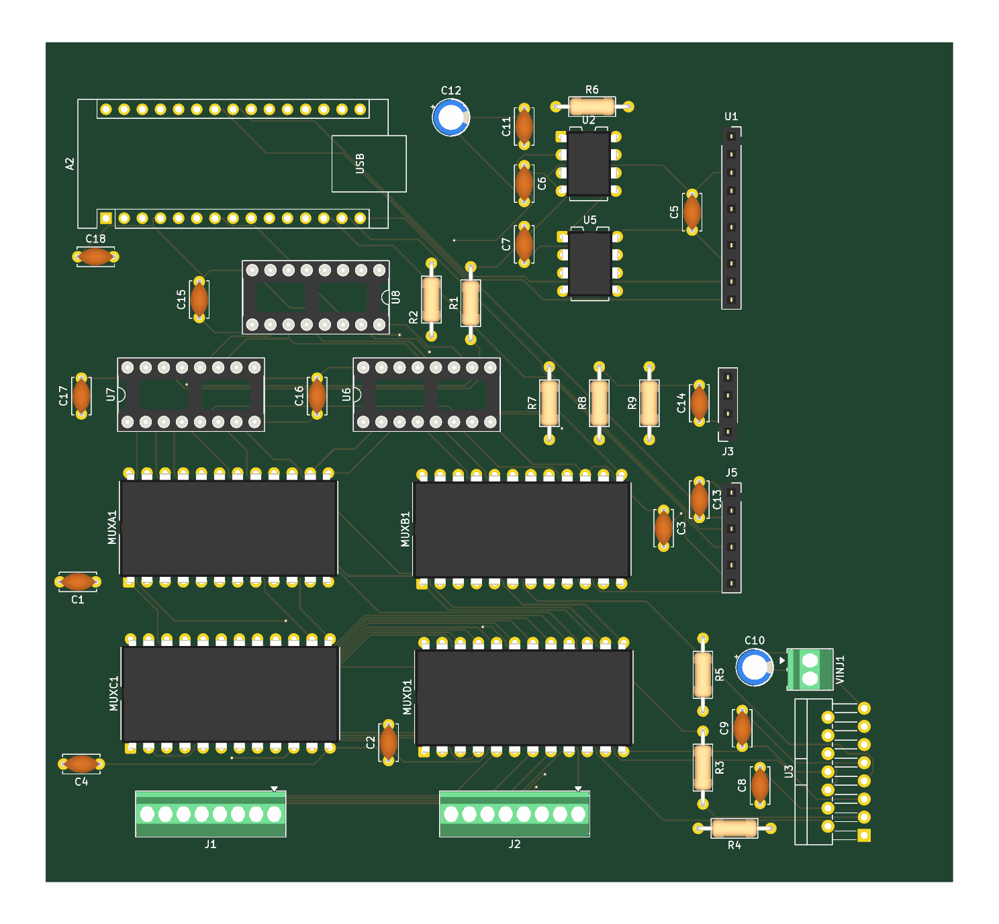
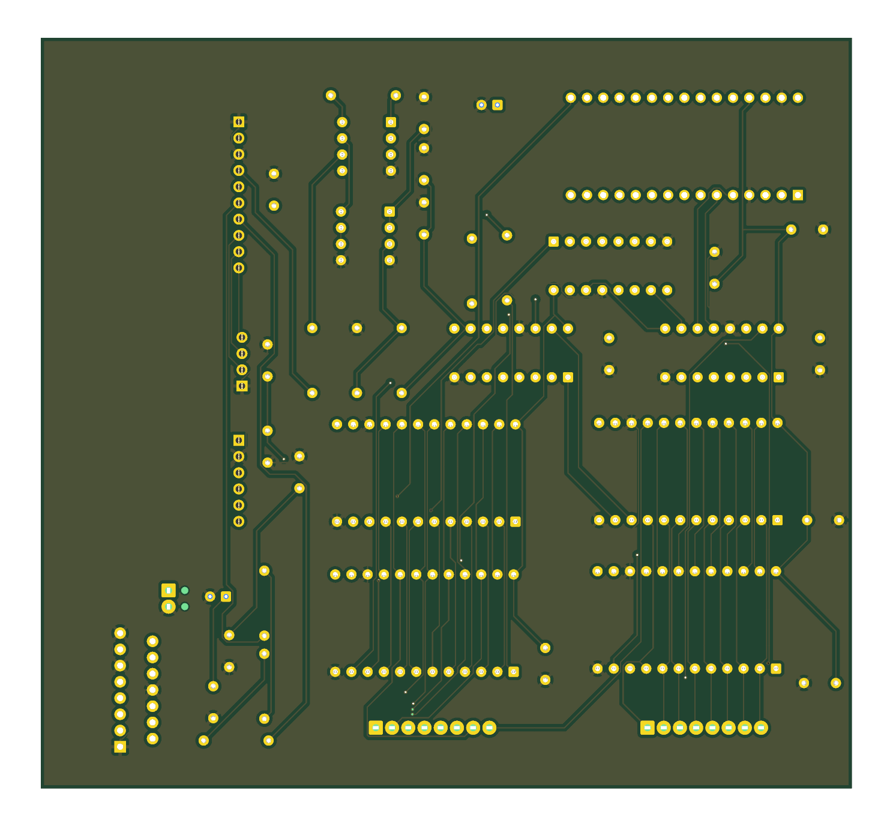

# Hardware

The electrical design and the breadboard wiring reference are in
[docs/hardware.md](../docs/hardware.md); the physical build guide for
both versions is [docs/assembly.md](../docs/assembly.md). This directory
holds the custom PCB: KiCad sources, fabrication files, reports, images,
and the bill of materials.

## Status

- [x] Schematic complete; ERC run, 5 errors and 22 warnings, all explained below
- [x] Layout routed on 2 layers; DRC clean apart from one silkscreen overlap
- [x] Gerbers and drill file generated from the board sources
- [ ] Boards fabricated
- [ ] Board assembled and brought up with [sketch 07](../firmware/07_pcb_console/)
- [ ] Bench result reproduced on the PCB (98.6 Ω on the 100 Ω reference)

Before ordering, read the review notes at the end of this page. One of
them (the ADS1115 socket pin order) needs a decision.

## Board at a glance

| | |
|---|---|
| Tool | KiCad 10.0.5, sources in [kicad/](kicad/) |
| Size | 127.05 x 117.55 mm, 2 layers, 1.6 mm FR4 |
| Parts | 44 footprints, all through-hole; every IC in a DIP socket |
| Controller | Arduino Nano v3 on headers, powered over USB |
| Control lines | 3 (SER, SRCLK, RCLK) into a chain of three 74HC595s, replacing the Mega's 18 direct pins |
| Design rules | 0.2 mm track, 0.15 mm clearance, 0.6 mm vias, 0.5 mm copper-to-edge |
| Copper | ground pour on the bottom layer, 840 track segments, 17 vias |
| Connectors | two 8-way screw terminals for electrodes E0-E15, 2-way screw terminal for the injection supply, I2C header, SPI header |
| Reports | [reports/drc.rpt](reports/drc.rpt), [reports/erc.rpt](reports/erc.rpt) |
| Schematic | [schematic.pdf](schematic.pdf), [images/schematic.png](images/schematic.png) |
| BOM | [bom.csv](bom.csv), exported from the schematic |

## What changed from the breadboard

| | Breadboard (validated) | PCB |
|---|---|---|
| Controller | Arduino Mega, 18 direct control pins | Arduino Nano, 3 pins into three 74HC595 shift registers |
| Bridge control | two Mega pins to L298N IN1/IN2 | U8 outputs QA/QB to IN1/IN2 |
| L298N | driver module | bare L298N (Multiwatt-15) on the board, EnA tied high, bridge B unused |
| Amplifier gain | 10 kΩ trimmer, measured 76 | fixed R6 = 1 kΩ, 50.4 nominal, no trimmer |
| Offset / reference | trimmer into the LM358 buffer | fixed 10k/10k divider (R7/R8) into the LM358 buffer, 2.5 V |
| ADS1115 | breakout on the breadboard | same breakout plugged into a 10-pin socket, U1 |
| Protection | 10 kΩ on ADC inputs | 10 kΩ on every ADC input (R4, R5, R9) and both amplifier inputs (R1, R2) |
| Electrodes | jumper wires | screw terminals J1 (E0-E7), J2 (E8-E15) |
| Decoupling | some | 100 nF at every IC, 10 µF on the 5 V rail, 100 µF + 100 nF on the injection supply |

No trimmers means calibration on the PCB reduces to measuring the gain
(step 4 of [docs/calibration.md](../docs/calibration.md)). If the
amplifier saturates, lower the injection voltage or increase R6.

## Floorplan

Top view, matching the render above. The Nano sits in the top-left
corner with its USB connector facing into the board. The three shift
registers are below it (U8 directly under the Nano, U7 and U6 in a row
beneath). The analog front end is in the top-right: the AD620 (U2) with
its gain resistor R6 above it, the LM358 reference buffer (U5) below it,
and the ADS1115 socket (U1) at the right edge. The sense-side protection
resistors R1/R2 sit between the shift registers and the amplifier; the
reference divider R7/R8 and the output protection R9 are to their right.
The four muxes form a 2x2 block in the lower half (A and B on top, C and
D below) with the electrode terminals J1 and J2 on the bottom edge
directly beneath them. The injection parts are grouped in the
bottom-right corner: the L298N (U3, upright at the right edge), the
injection terminal VINJ1, the 100 µF bulk capacitor C10, the shunt R3,
and its protection resistors R4/R5. The I2C header J3 and SPI header J5
are on the right edge, mid-board.

## Shift register chain

This is the part the firmware has to get right.

Nano D2 clocks SRCLK on all three registers, D3 clocks RCLK on all three,
and D4 feeds SER of U6. U6's QH' feeds U7's SER, and U7's QH' feeds U8's
SER. Output enable (~OE) is tied to ground on all three, so the outputs
are always driven; ~SRCLR is tied to 5 V.

| Register | Outputs | Drives |
|---|---|---|
| U6 | QA, QB, QC, QD | MUX A (C1) S0, S1, S2, S3 |
| U6 | QE, QF, QG, QH | MUX B (C2) S0, S1, S2, S3 |
| U7 | QA, QB, QC, QD | MUX C (P1) S0, S1, S2, S3 |
| U7 | QE, QF, QG, QH | MUX D (P2) S0, S1, S2, S3 |
| U8 | QA, QB | L298N IN1, IN2 |
| U8 | QC-QH | unused |

Shifting 24 bits MSB-first, U8's byte first, then U7's, then U6's, puts
bit 0 of each byte on that register's QA. So U6's byte is
`chA | (chB << 4)`, U7's is `chC | (chD << 4)`, and U8's is
`IN1 | (IN2 << 1)`. Sketch 07 does exactly this in `latch()`.

## Nano pin map

| Nano | Net |
|---|---|
| D2 | 74HC595 SRCLK (all three) |
| D3 | 74HC595 RCLK (all three) |
| D4 | 74HC595 SER, into U6 |
| A4, A5 | I2C SDA, SCL: ADS1115 and header J3 |
| D10, D11, D12, D13 | SPI CS, MOSI, MISO, SCK: header J5 only, unused by the firmware |
| 5V, GND | board logic supply, from the Nano's USB |
| VIN, 3V3, D0-D1, D5-D9, A0-A3, A6-A7 | not connected |

## Connectors

| Ref | Type | Pin 1 to pin N |
|---|---|---|
| J1 | 8-way screw terminal, 2.54 mm | E0, E1, E2, E3, E4, E5, E6, E7 |
| J2 | 8-way screw terminal, 2.54 mm | E8, E9, E10, E11, E12, E13, E14, E15 |
| VINJ1 | 2-way screw terminal | injection supply +, GND |
| J3 | 1x4 socket | GND, 5V, SDA, SCL |
| J5 | 1x6 socket | 5V, GND, MISO (D12), MOSI (D11), SCK (D13), CS (D10) |
| U1 | 1x10 socket | see the review notes below before fitting a breakout |

## Bill of materials

From the KiCad schematic ([bom.csv](bom.csv)), with approximate
single-unit prices.

| Ref | Qty | Part | Package | ~Price |
|---|---|---|---|---|
| A2 | 1 | Arduino Nano v3 (clone) | module, on 1x15 headers | $5 |
| U1 | 1 | ADS1115 breakout | 1x10 socket | $10 |
| U2 | 1 | AD620AN | DIP-8 | $10 |
| U3 | 1 | L298N | Multiwatt-15 (TO-220-15), vertical | $3 |
| U5 | 1 | LM358 | DIP-8 | $1 |
| U6, U7, U8 | 3 | 74HC595 | DIP-16 | $1 ea |
| MUXA1-MUXD1 | 4 | CD74HC4067E | DIP-24 | $2 ea |
| R1, R2, R4, R5, R7, R8, R9 | 7 | 10 kΩ | axial | |
| R3 | 1 | 1 kΩ 1%, shunt | axial | |
| R6 | 1 | 1 kΩ, AD620 gain | axial | |
| C1-C9, C11, C13-C18 | 16 | 100 nF ceramic | 5 mm disc | |
| C10 | 1 | 100 µF electrolytic | radial, 2.5 mm pitch | |
| C12 | 1 | 10 µF electrolytic | radial, 2.5 mm pitch | |
| J1, J2 | 2 | 8-way screw terminal, 2.54 mm (Phoenix MPT 0,5/8) | | $2 ea |
| VINJ1 | 1 | 2-way screw terminal, 2.54 mm | | $1 |
| J3, J5 | 2 | 1x4 and 1x6 pin sockets | | |
| | 9 | DIP sockets: 2x 8-pin, 3x 16-pin, 4x 24-pin | | $3 |
| | 1 | bare 2-layer PCB from any prototype fab | | $5-10 for five |

Breadboard-only extras (trimmers, breadboards, jumpers) and the parts
common to both builds (electrode rods, 12 V supply, wire) are in
[docs/assembly.md](../docs/assembly.md). The whole build still lands
near $150.

## Fabrication

[gerbers/](gerbers/) has the seven layer files, the drill file, and the
job file, generated from `kicad/diy-ert.kicad_pcb` with `kicad-cli` (the
exact commands are in [kicad/README.md](kicad/README.md)). Zip the
directory and upload it; the board needs nothing beyond any prototype
fab's defaults: 2 layers, 1.6 mm, 0.2 mm minimum track, 0.15 mm
clearance, HASL finish is fine.

The set exported on 2026-08-29 predates the last save of the board file
by a couple of hours, so the committed set is regenerated from the board
as saved. Compared line by line with aperture numbering normalised, the
two sets are geometrically identical: same apertures, same pads, same
tracks on every layer. The only difference is one unused aperture
selection in the older copper and mask files.

## History

- 2026-08-22 to 08-24: schematic drawn around the Mega, netlist exported
  repeatedly while footprints were assigned and the amplifier stage
  added.
- Around 08-25: a 4-layer layout attempt. An autorouter round trip
  produced 686 DRC violations (201 net shorts, 199 dangling tracks) from
  a layer-mapping mismatch on re-import. Lesson: autorouters do not know
  which nets are noise-sensitive; hand-route the analog paths and lock
  them, or hand-route everything on a board this size.
- 2026-08-29: redesign around the Nano and three 74HC595s, taking the
  control pin count from 18 to 3. Two-layer layout, Freerouting DSN
  export, DRC with one silkscreen warning, gerbers exported, board saved.

## Review notes

Things noticed while reading the design files for this write-up. None
have been tested on a physical board yet.

1. **ADS1115 socket pin order.** U1 uses the ADS1115 chip symbol with a
   1x10 pin-socket footprint, so the socket pins follow the IC's pin
   numbering: ADDR, ALERT, GND, A0, A1, A2, A3, VDD, SDA, SCL from pin 1
   to pin 10. The common breakout modules (Adafruit and the clones) have
   their header in the order VDD, GND, SCL, SDA, ADDR, ALRT, A0, A1, A2,
   A3. Plugged straight in, a standard breakout would put its VDD on the
   pad that is wired to ground. Before ordering, either swap the symbol
   for one that matches the breakout header, or plan on an adapter
   between the socket and the module. Check your specific module's
   silkscreen against this list.
2. **Shift register outputs at power-on.** ~OE is tied to ground on all
   three 74HC595s, so their outputs drive the mux select lines and the
   L298N inputs from the moment power arrives, with undefined contents,
   until the firmware latches a state. Sketch 07 does that first thing in
   `setup()`, but the Nano bootloader runs for about a second before it.
   A future revision could drive ~OE from a Nano pin with a pull-up so
   the outputs stay high-impedance until the firmware takes over. Until
   then, power the logic before connecting the injection supply.
3. **Fixed gain.** R6 = 1 kΩ gives a nominal gain of 50.4 with the
   reference at 2.5 V. The field reading of 28.5 mV across P1-P2 would
   swing the output by about 1.4 V either side of 2.5 V, which is inside
   the AD620's output range on a 5 V supply but not by a lot. Larger
   signals need a lower injection voltage or a larger R6. The `t`
   command in sketch 07 flags readings near the rails.
4. **C10 polarity.** C10 (100 µF on the injection supply) is drawn with a
   plain capacitor symbol but has a polarised footprint. Fit it with the
   positive lead to the VINJ1 side.
5. **I2C pull-ups.** There are none on the board; the ADS1115 breakout
   provides them. A bare chip in U1 would need them added.
6. **Silkscreen.** The one DRC warning is U2's reference designator
   overlapping R6's outline. Cosmetic.
7. **ERC.** The five errors are all "pin not driven": the Nano's VIN,
   both RESET pins, and AREF (unused, normal for that symbol), and the
   L298N's Vs, which enters through the VINJ1 connector and would be
   silenced by a PWR_FLAG on that net. The warnings are unused pins
   (Nano, L298N bridge B, ADS1115 ALERT, U8 QC-QH), one short wire stub
   near the Nano's 3V3 pin, and "Vss not connected to ground": the KiCad
   L298N symbol names its logic-supply pin Vss, and it is correctly on
   5 V.
8. **Track width.** 0.2 mm everywhere, including the 5 V and injection
   paths. Fine for the currents involved (about a milliampere of
   injection, tens of milliamperes of logic) and for any fab, but thin
   for hand rework. A future revision could widen the supply traces.
